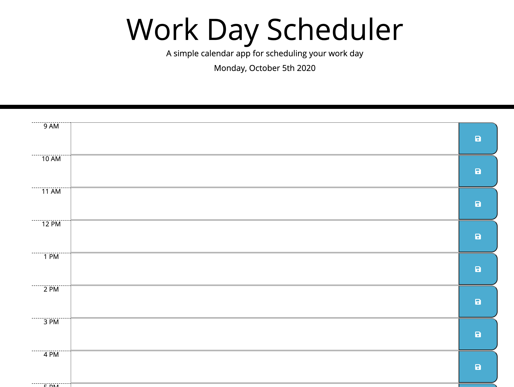

# Work Day Scheduler

## This application allows a user to create a simple day schedule to track work progress

**The current day is shown at the top of the calendar**

**Features:**
1. User can click on the details area and enter text
2. Clicking on the save button / icon will save the task to local storage
3. The 'hour' sections are created using javascript
4. Styling is done via a combinaton of manual code and external libraries

Application URL: https://sterlynkong.github.io/password-generator/

Application image: 